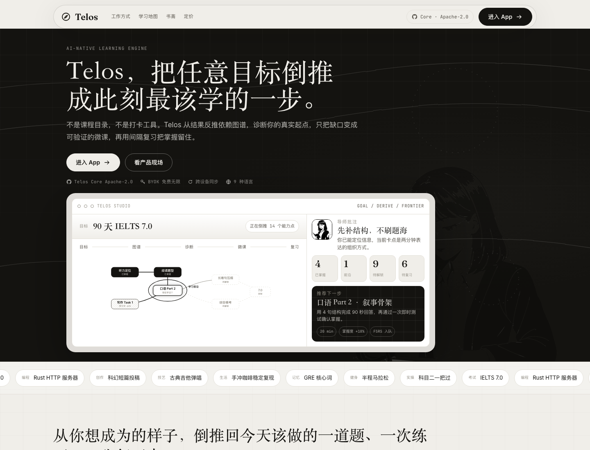
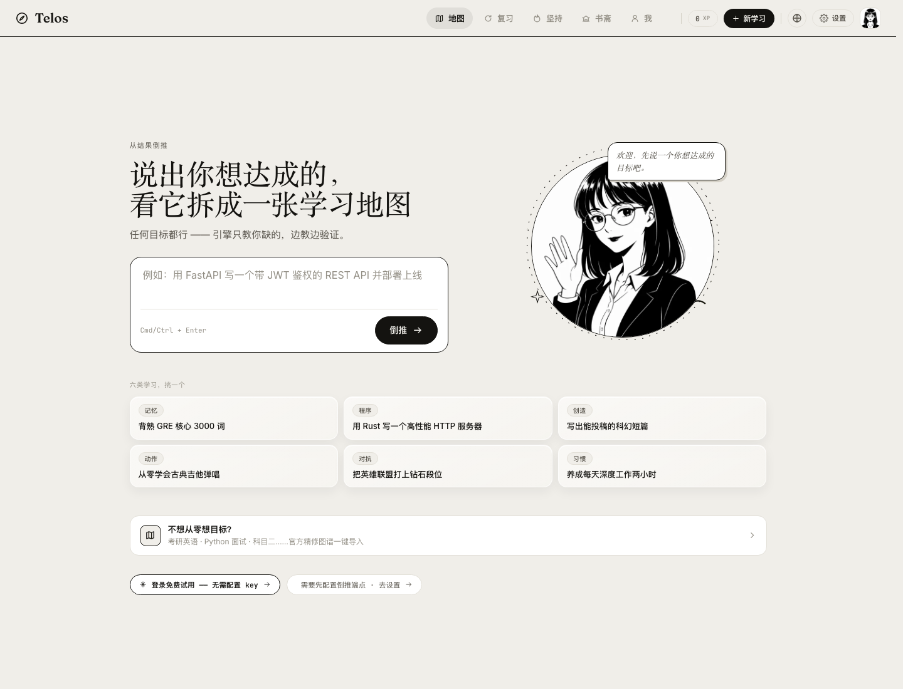
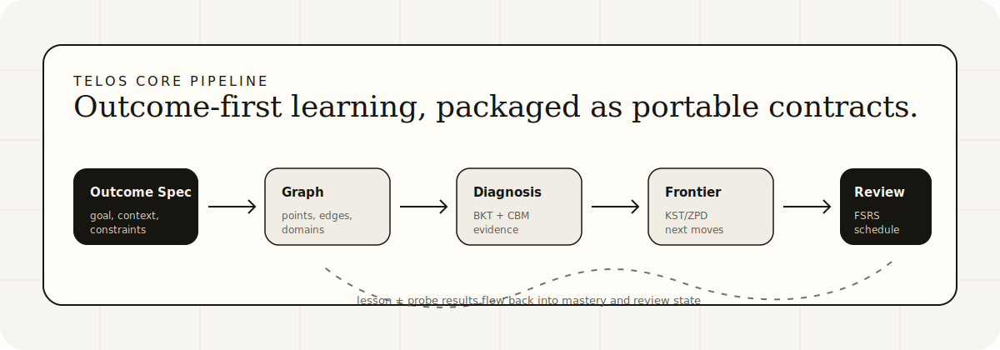

# Telos

Reverse-design learning. Tell Telos what you want to master, and it builds the dependency graph, diagnoses where you are, teaches only the missing edges, and schedules review.

[Live demo](https://telos.ungetsu.net/) · [Open the app](https://telos.ungetsu.net/app/) · [中文 README](README.zh-CN.md)





## Why Telos

Most learning tools start from content. Telos starts from the outcome.

- Goal to graph: break an outcome into prerequisite knowledge points.
- Diagnosis first: find the learner's actual starting point before teaching.
- Just-enough lessons: explain, quiz, repair, and verify each missing node.
- Review loop: keep mastered nodes alive with FSRS-style scheduling.
- Local-first Community Edition: run the product app and reference runtime on your own machine.

Use the hosted Telos at [telos.ungetsu.net](https://telos.ungetsu.net/) for cloud sync, managed workflows, and the official deployment.

## Quick Start

```bash
git clone https://github.com/YunyueLi/telos.git
cd telos
./start.sh
```

Then open [http://localhost:3000](http://localhost:3000). The web app automatically connects to the local runtime at `127.0.0.1:8787`.

For the AI parts, copy `core/.env.example` to `core/.env` and add an OpenAI-compatible key:

```bash
TELOS_LLM_API_KEY=your-api-key
TELOS_LLM_BASE_URL=https://api.deepseek.com
TELOS_LLM_MODEL=deepseek-v4-pro
```

Run the engine tests:

```bash
make test
```

Run with Docker:

```bash
docker compose up --build
```

## What You Can Build

- Personal mastery maps for any technical or academic goal.
- Course generators that adapt to a learner's current knowledge state.
- Study agents that use Telos Core as the planning and review engine.
- Self-hosted learning products with local-first data and BYOK model access.
- Research prototypes around knowledge tracing, prerequisite graphs, and review scheduling.

## Architecture



| Area | What it contains |
| --- | --- |
| `landing/` | Static marketing page served at `/`. |
| `web/` | Next.js app served at `/app/`, with map, diagnosis, review, studio, settings, and local-first project state. |
| `core/` | Zero-dependency Python learning engine and local reference runtime. |
| `skill/` | Agent skill package for using Telos inside external agent workflows. |
| `scripts/` | Static export and local build helpers. |
| `docs/` | Product design notes, roadmap, and deployment guide. |

The Community Edition is intentionally runnable: the product UI, local graph workflow, reference server, examples, tests, and docs live here in the canonical public repository.

## Community

Issues and pull requests are open for the Community Edition. Good contributions usually improve:

- learning-engine correctness and tests
- graph/data contracts
- local runtime reliability
- web app usability
- examples, docs, and self-hosting paths

Read [CONTRIBUTING.md](CONTRIBUTING.md), [DEPLOYMENT.md](DEPLOYMENT.md), and [BRAND.md](BRAND.md) before opening larger changes.

## License

Telos Community Edition is licensed under AGPL-3.0. The standalone `core/` package is additionally provided under Apache-2.0 for SDK/protocol-level reuse. See [NOTICE](NOTICE) for boundaries.
